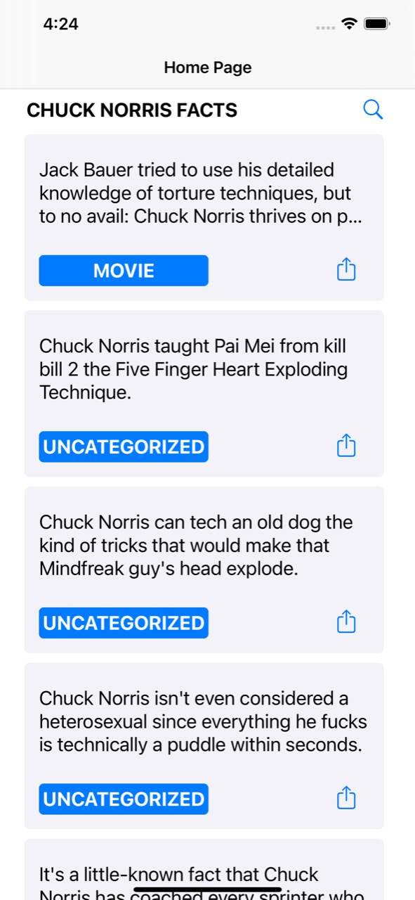

<h1 align="center">
  
</h1>

<p align="center">
  
  
</p>


<p align="center">
  
  
</p>

## :memo: Projeto

Essa aplicação permite a busca, a listagem de fatos sobre Chuck Norris cletados a partir da [api](https://api.chucknorris.io/).

## :rocket: Tecnologias

- [Swift](https://www.apple.com/br/swift/)

## :gear: Rodando o projeto
``` bash
  $git clone https://github.com/frapimoneto/IOS/Teste
  $cd Teste
  $pod install
```

Feito com ❤ por Francisco Pinto Moreira Neto 😃 [Get in touch!](https://github.com/frapimoneto)